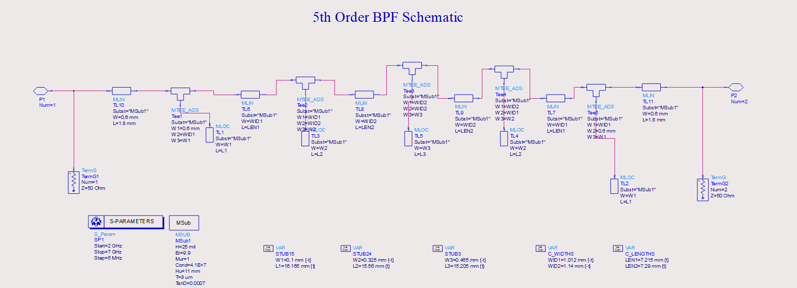
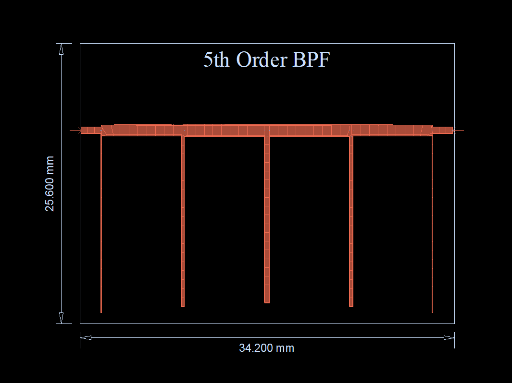
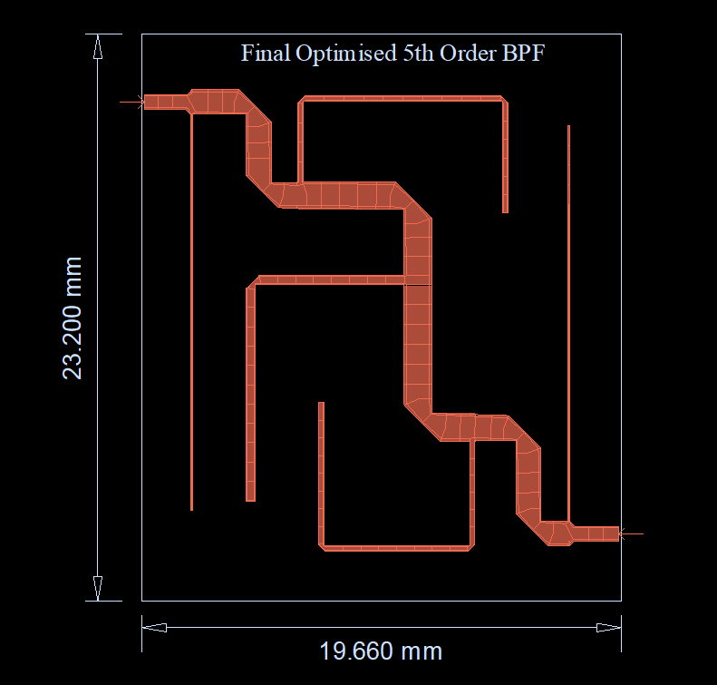
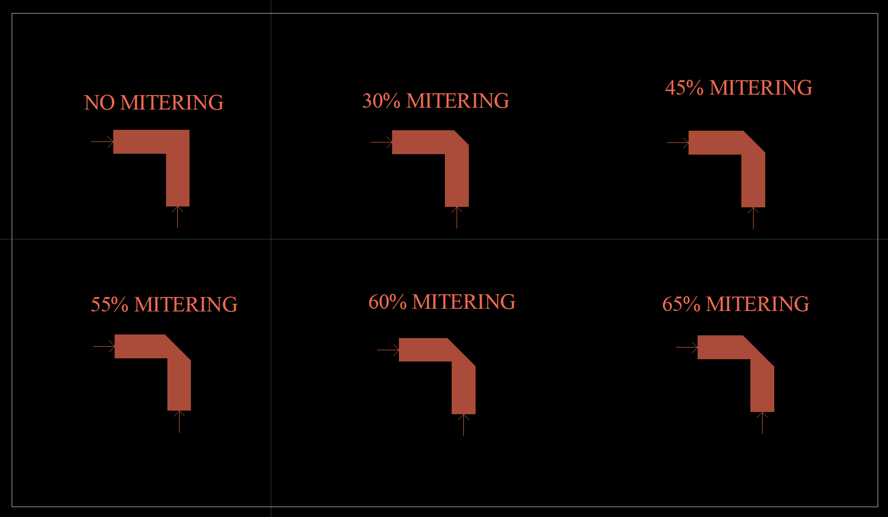
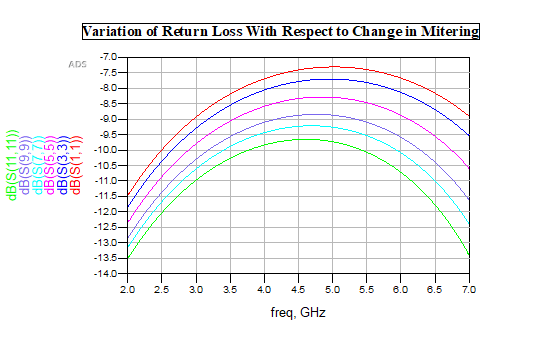
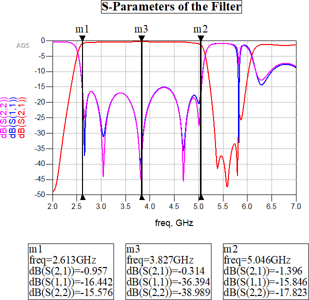

# 📘 5th Order Open-Stub Filter Design

## 🔧 Design Summary
- **Filter Order**: 5
- **Topology**: Open-stub (λg/2) with (λg/4) connecting lines
- **Objective**: Achieve compact layout and minimal insertion/return loss within 1 inch × 1 inch area
- **Focus Areas**: Layout optimization through bending and mitering techniques

---

## 📐 Schematic View

## 📉 Schematic S-Parameter Response
📄 [View Full Schematic Response (PDF)](./5th_order_schem_res.pdf)

---

## 🧱 Layout Versions

### 🔸 Version 1: Initial Layout (Unbent, Unmitered)
- Layout implemented with straight, unfolded resonator lines.
- Nearly matched the electrical specs but exceeded area constraints.
- Slight mismatch and signal reflection observed in EM simulation.

📄 [View EM Simulation – Initial Layout (PDF)](./5th_order_layout_res.pdf)

---

### 🔸 Version 2: Optimized Layout with Bends and Mitering
- Introduced **bends** to fold long resonators and reduce layout area.
- **Mitered corners** added to reduce discontinuity and radiation at 90° turns.
- ✅ Final layout fits well within 1 inch × 1 inch.
- ✅ Provides improved impedance matching and minimized loss.

---

## 🧩 Mitering Technique Details

Mitering improves corner performance in microstrip layouts by cutting corners at an angle to reduce signal reflection and parasitic effects.

### ✂️ Why Mitering is Important:
- Reduces abrupt impedance discontinuities at 90° bends
- Improves power transfer across microstrip joints
- Reduces radiation and cross-talk

---

### 🧪 Mitering Ratio Experiment

Several ratios were tested to observe effects on S-parameters. The best trade-off was found at:

- ✅ **65% Mitering Ratio**

---

### 📈 Mitering Comparison – S21 (Insertion Loss)

#### ➡️ With Different Mitering Ratios:

---

### 📉 Mitering Comparison – S11 (Return Loss)

#### ➡️ With Different Mitering Ratios:

---

## 📄 Full EM Response for Final Mitered Layout

---

## 🔍 Observations

- **Schematic** met theoretical targets with minor stub tuning.
- **Initial Layout** exceeded size limits and had weak port match.
- **Mitered Layout**:
  - Used bends and **65% mitering** to create a compact, fabrication-friendly layout.
  - Achieved **better return loss (>15 dB)** and **insertion loss (~1.75 dB)**.
  - Passed all performance criteria and became the base for HRF integration.

✅ This layout was finalized and integrated with the Harmonic Rejection Filter for the full filter system.

