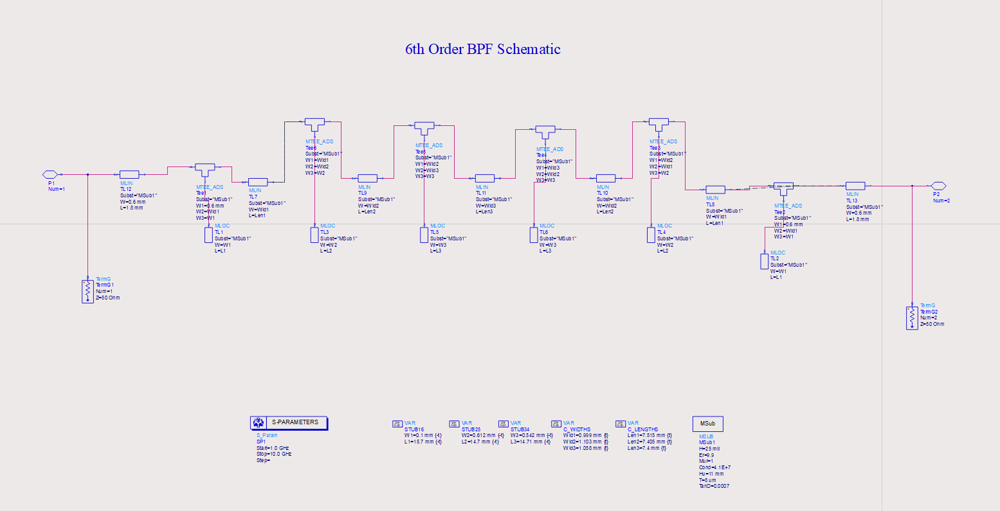
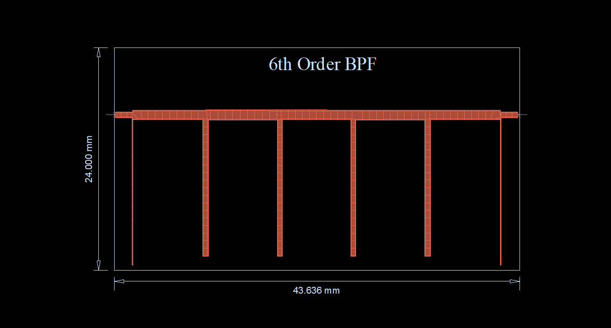

# 📘 6th Order Open-Stub Filter Design

This was the **second iteration**, reducing the filter order to 6 to improve performance and layout compactness.

## 🔧 Design Summary
- **Order**: 6
- **Topology**: Open-stub (λg/2) with (λg/4) connecting lines
- **Stub count**: 6
- **Approach**: Maintain Chebyshev response with ~0.3 dB ripple

## 📐 Schematic View

## 📉 Schematic S-Parameter Response
📄 [View Full Response Plot (PDF)](./6th_ode_schem_res.pdf)

### 🔍 Observation:
- Return loss improved at upper band edge.
- Lower passband still **not fully satisfied**.

---

## 🧱 Layout Design

### 📉 Layout S-Parameter Response
📄 [View Full Response Plot (PDF)](./6th_odr_layout_res.pdf)

### 🔍 Observation:
- Improved **passband coverage**.
- However, **S11 performance degraded**.
- Size constraints **still a challenge**.

## 🧠 Takeaway:
- Reducing order helped area and insertion loss.
- Bending may help in area optimization.
- Still room for optimization → moved to 5th order design.

