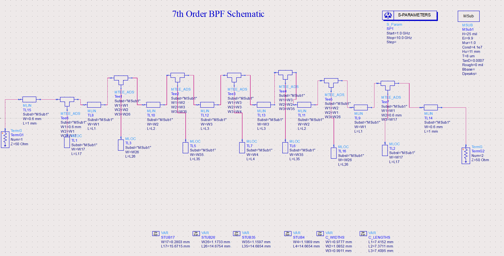
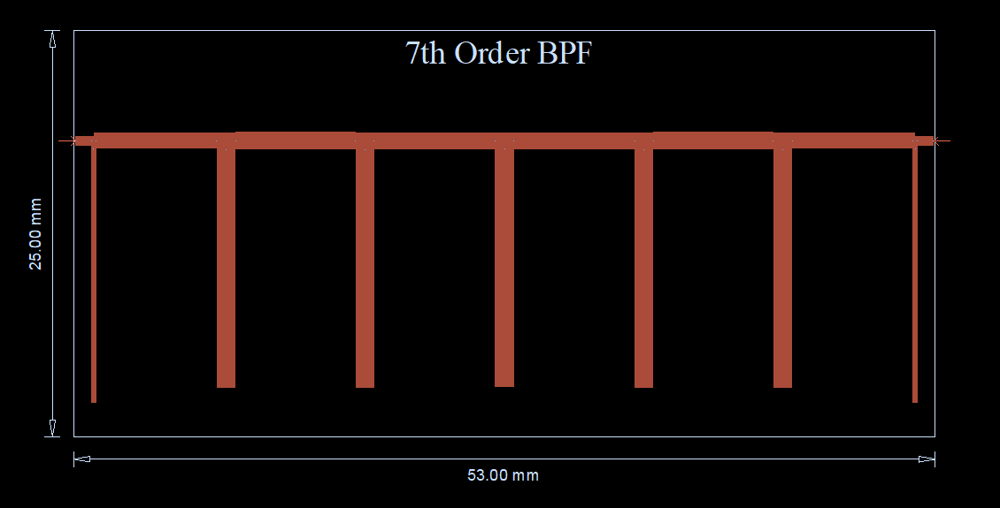

# 📘 7th Order Open-Stub Filter Design

This was the **first attempt** at designing a Chebyshev bandpass filter with a **7th-order open-stub topology**.

## 🔧 Design Summary
- **Order**: 7
- **Topology**: Open-stub (λg/2) with (λg/4) connecting lines
- **Stub count**: 7
- **Technology**: Alumina substrate (εr = 9.9), Gold conductor
- **Goal**: Meet all specs including size, insertion loss, and return loss

## 📐 Schematic View

## 📉 Schematic S-Parameter Response
📄 [View Full Response Plot (PDF)](./7th_odr_schem_response.pdf)

### 🔍 Observation:
- The **schematic simulation** did not fully meet specifications.
- **High insertion loss** and sub optimal pass band behavior.

---

## 🧱 Layout Design

### 📉 Layout S-Parameter Response
📄 [View Full Response Plot (PDF)](./7th_odr_layout_response.pdf)

### 🔍 Observation:
- Performance improved slightly in EM simulation, but:
  - **Return loss** was not within the acceptable range.
  - Layout **exceeded the 1×1 inch area constraint**.
  - Bending of the structure didn't improve the responses much.
- ❌ Concluded unsuitable for further optimization.

