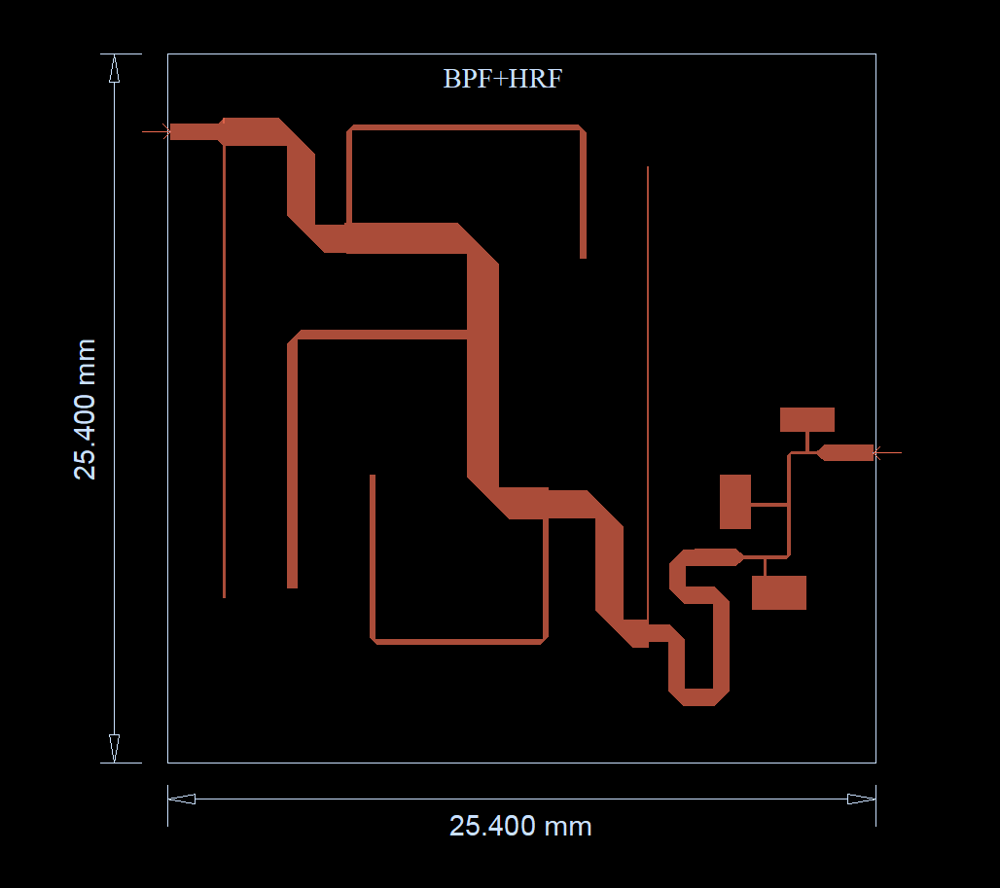
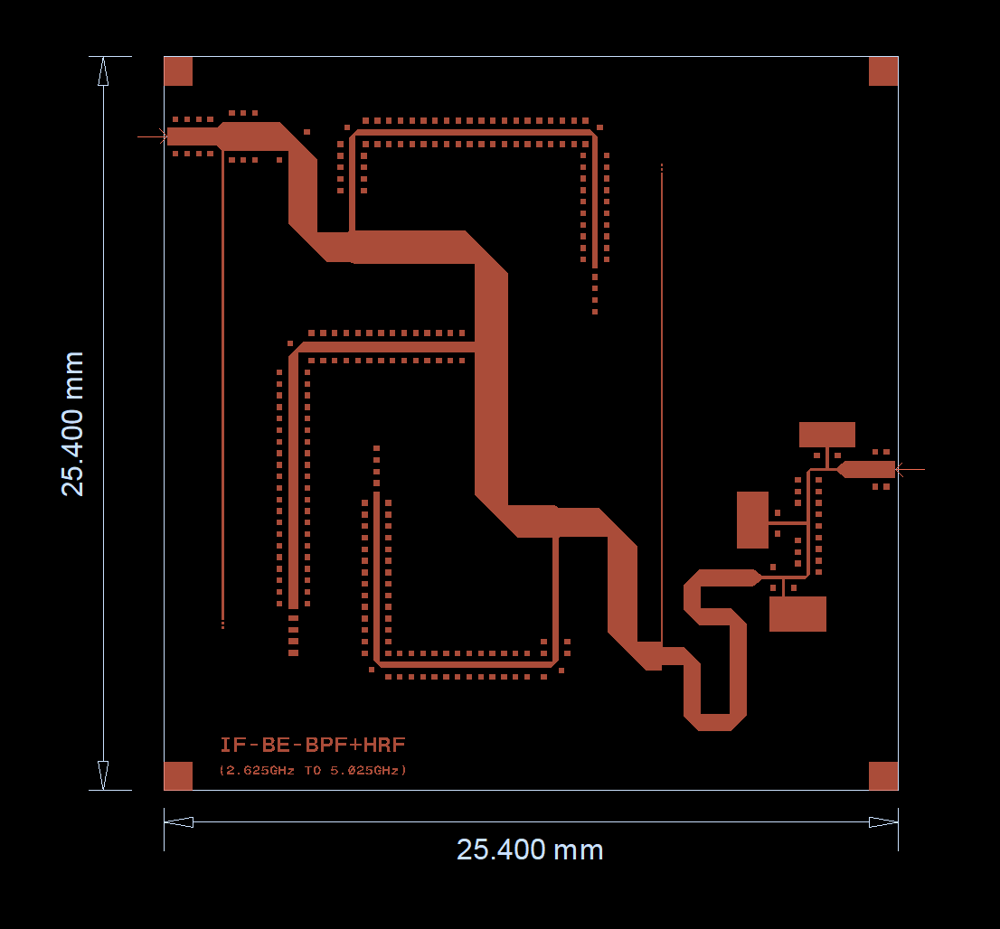
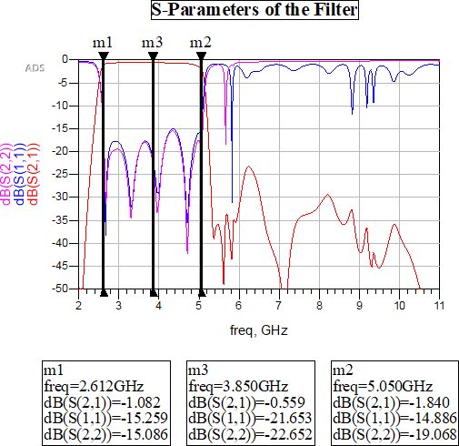
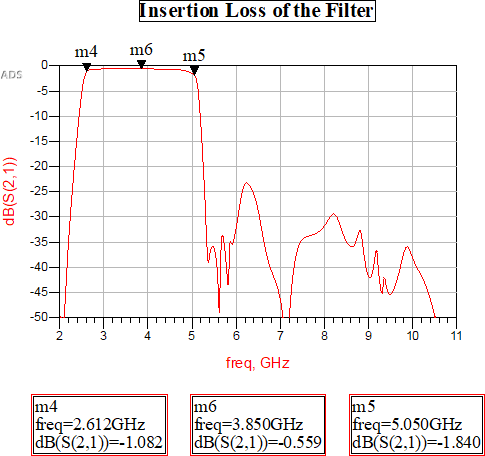
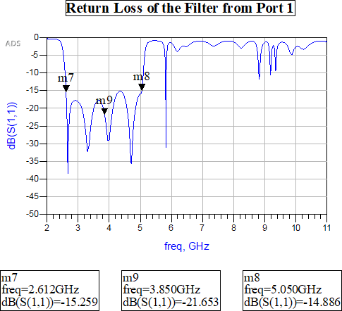
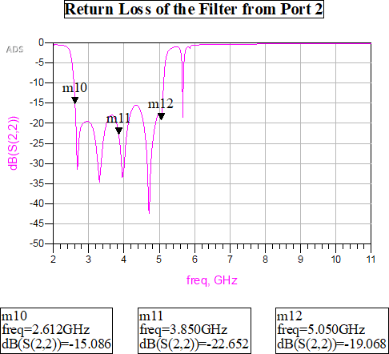
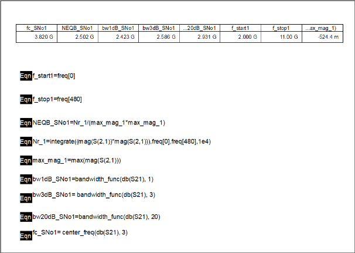

# 📘 Final Proposed Design – Integrated 5th Order BPF + 7th Order HRF

## 🎯 Overview

The final design integrates the best-performing **5th order open-stub Band Pass Filter (BPF)** with a **7th order elliptic Harmonic Rejection Filter (HRF)**. Together, they satisfy all the specified requirements:

- UWB passband coverage (2.625–5.025 GHz)
- Stopband suppression >25 dBc from 5.55–17.25 GHz
- Compact layout within a 1-inch × 1-inch substrate
- Insertion loss < 2 dB
- Return loss > 15 dB
- NEB within 2400 MHz ±10%

---

## 🧩 Integration Strategy

Both filters were optimized individually and then cascaded. However, impedance mismatch between them introduced insertion loss and return loss degradation. To address this:

- **Two matching techniques** were attempted:
  - **T-section matching network**
  - **Stepped impedance transformer**
- Both were promising but **exceeded area constraints**.
- ✅ A **10 mm long, 0.6 mm wide microstrip line** was finally used as the interconnection element, providing a balanced match within substrate limits.

---

## 🧱 Final Layout Variants

### 🔸 Version A: Without Tuning Pads

This layout was finalized based on:
- Compact arrangement
- Use of 65% mitering ratio for BPF corners (optimized from previous trials)
- Direct connection between BPF and HRF

---

### 🔸 Version B: With Tuning Pads

Tuning pads were added at port ends and selected junctions for practical testability. These allow impedance fine-tuning after fabrication using probing or laser trimming.

---

## 📊 EM Simulation Results

### S-Parameter Overview

- Clean passband response
- Sharp harmonic rejection beyond 5.5 GHz
- Minimal ripple

### Insertion Loss

- The insertion loss is maintained within the given limits for the entire passband

### Return Loss (Both Ports)

- S₁₁ and S₂₂ better than –15 dB throughout passband
- Reflects high-quality match at both ends

---

## 📏 Noise Equivalent Bandwidth (NEB)

- Calculated from the integrated response
- **Result**: ~2.502 GHz, well within the ±10% specification range
- Band edges: ~2.612 GHz to ~5.050 GHz

---

## ✅ Observations

- The combined system **eliminated the extra harmonic passbands** that plagued the BPF-only design.
- **Return loss** was significantly improved due to layout tuning and interconnect optimization.
- **Insertion loss** remained <2 dB, maxing out at ~1.84 dB near 5.05 GHz
- The entire layout **fit within the 1 inch × 1 inch constraint** even with tuning pads.

---

## 📌 Conclusion

✅ This design satisfies **all functional, electrical, and physical specifications**, and is **ready for fabrication and testing**. The addition of tuning pads further ensures adaptability during experimental validation.

