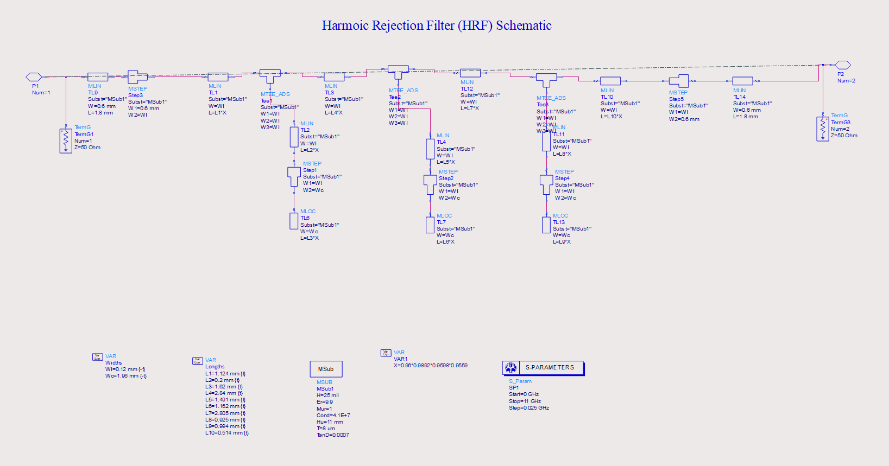
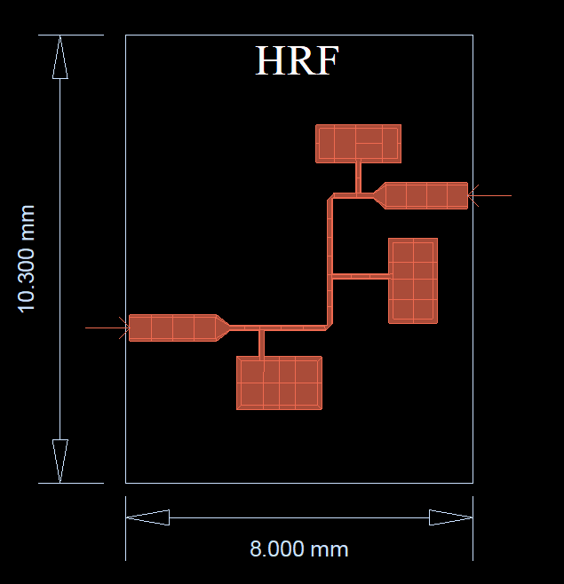
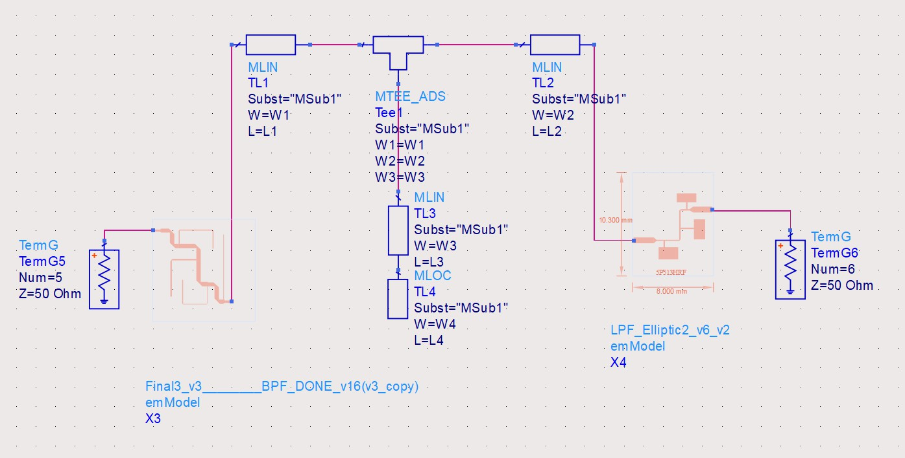
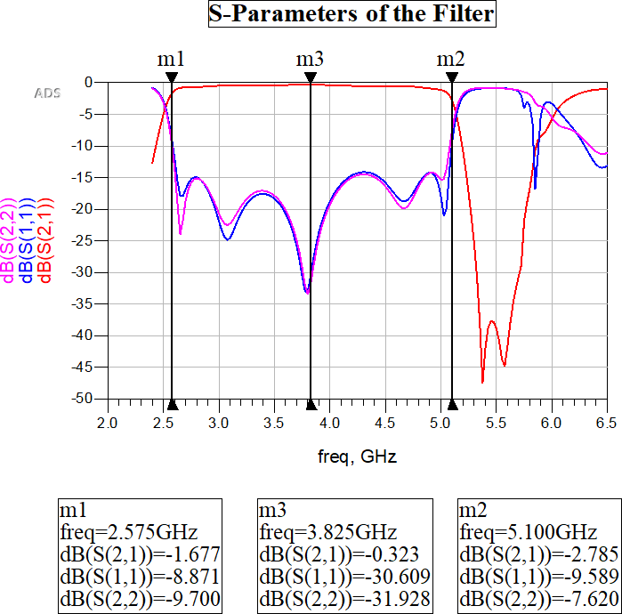
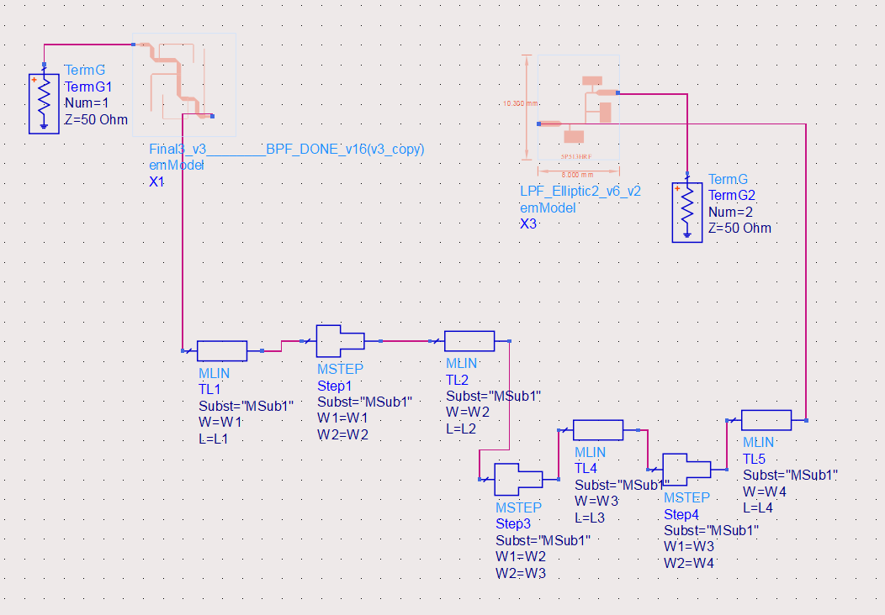
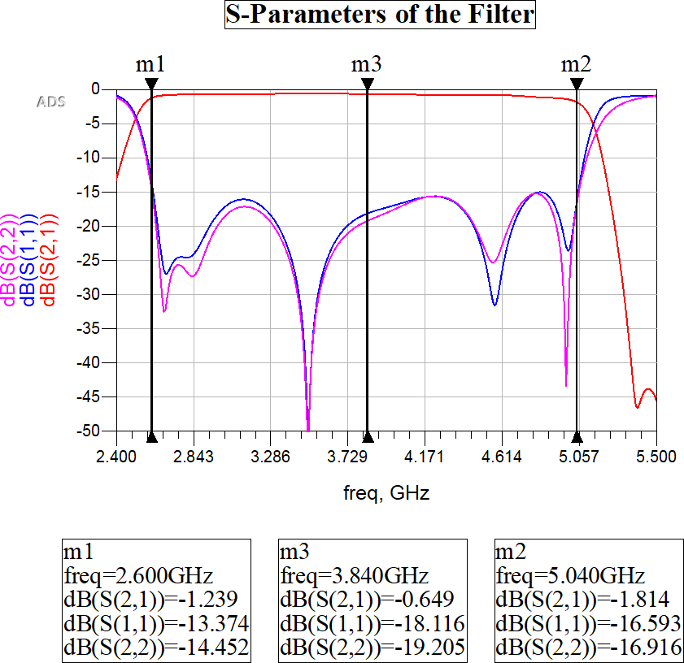

# 📘 7th Order Harmonic Rejection Filter (HRF)

## 🎯 Why This Was Needed

The final 5th-order Band Pass Filter (BPF) designed using open-stub topology, although optimized in terms of size and return/insertion loss, **suffered from extra passbands beyond the desired upper cutoff (5.025 GHz)**. These are higher-order harmonics resulting from the non-ideal response of the open-stub design, typically appearing near **3f₀/2 (≈ 5.7 GHz)** and beyond.

To comply with the specification of **>25 dBc stopband rejection between 5.55 GHz and 17.25 GHz**, a **Harmonic Rejection Filter (HRF)** was designed and added **in cascade** with the BPF.

---

## ⚙️ Theoretical Design Approach

- **Filter Type**: Elliptic Low-Pass (to realize sharp roll-off and equiripple stopband)
- **Response Objective**:
  - 3 dB cutoff near **5.3 GHz**
  - ≥30 dB attenuation at **6.2 GHz**
  - Minimal ripple (~0.1 dB) in passband
- **Order**: 7th order (selected after theoretical analysis)
- **Element Mapping**:
  - High impedance (90 Ω → 0.12 mm width): represents **series inductive behavior**
  - Low impedance (20 Ω → 1.96 mm width): represents **shunt capacitive behavior**
- **Design Calculations**:
  - λg and εeff computed using ADS LineCalc
  - Lengths calculated using standard microstrip inductor/capacitor transformation formulae
---

## 🧪 Practical Approach and Tuning

After schematic simulation, the filter’s 3 dB cutoff **shifted from 5.3 GHz to 6.3 GHz**. To correct this, all computed line lengths were **scaled using a factor ‘m’**, derived from the ratio of desired-to-actual cutoff frequencies.

The corrected layout was then simulated for S-parameters.

---

## 📐 Schematic View

📄 [View Full Schematic S-Parameters (PDF)](./Optimised_HRF_schem_res.pdf)

---

## 🧱 Layout View

The physical implementation used:

- Microstrip layout with **series λg/4 connecting lines wtih λg/4 and λg/2 stubs in series**, this is actually a dual representation for elliptic filter response design
- Manual routing to maintain electrical lengths while folding geometry
- Gold conductor, 25 mil Alumina substrate (εr = 9.9)

📄 [View Layout EM S-Parameters (PDF)](./Optimised_HRF_Layout_res.pdf)

---

## 🔧 Co-Simulation with BPF

Two impedance matching methods were evaluated to connect the HRF to the BPF:

### 🔸 Method 1: T-Section Matching
- Standard L-network between BPF and HRF
- Improved transition without much layout complexity

**Schematic:**

**S-Parameter Response:**

### 🔸 Method 2: Stepped Impedance Transformer
- Broader matching, but slightly bulky in layout

**Schematic:**

**S-Parameter Response:**

📌 Final integration used a **10 mm long, 0.6 mm wide microstrip** to connect the two sections due to **area constraint violations by both networks**:

---

## 📊 Performance Summary

| Parameter                          | Result                         |
|-----------------------------------|--------------------------------|
| Response Type                     | Elliptic                       |
| 3 dB Cutoff Frequency             | ~5.3 GHz (after tuning)       |
| Stopband Rejection @ 6.2 GHz     | ≥ 30 dB                        |
| Passband Ripple                   | ~0.1 dB                        |
| Return Loss (S₁₁)                 | >15 dB                         |
| Layout Area                       | ✅ < 1 inch × 1 inch           |
| EM Verified for Integration       | ✅ Yes                         |

---

## 🔍 Observations

- **Schematic Design**: Required tuning due to frequency shift
- **Layout Simulation**:
  - Verified all electrical and geometric specs
  - EM simulation confirmed expected elliptic behavior and harmonic suppression
- **Compact Integration**: Successfully fits substrate limit and integrates with 5th-order BPF

✅ **The HRF eliminates the unwanted passbands beyond 5.025 GHz**, helping meet the NEB and stopband suppression constraints when cascaded with the BPF.

